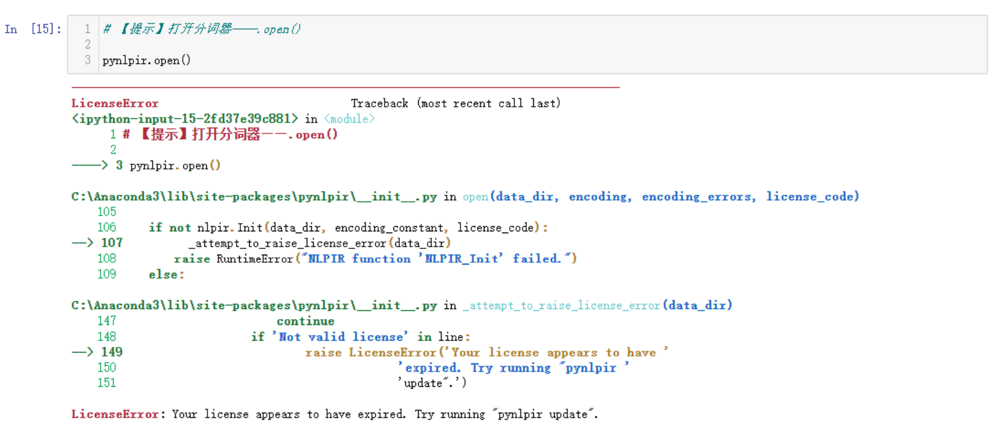

# 用pynlpir对《西游记》词频分析并生成词云
## 背景
词频分析，生成词云，其实我在一门课上刚刚学过，老师用jupyter notebook带着做了一遍。

在课上老师用的文本数据是一个比较小的20几K的文本。后来老师让对《西游记》做词频分析。《西游记》大小是1.9M

一开始我觉得很简单，直接用上课的代码就完了。结果因为自己的各种迷之操作~~，导致问题逐渐变得复杂。

本来很简单的一个任务，花费了我一天半才弄好。所以想将正确的实现过程和中间学到的知识，还有踩过的坑记录下来。

**运行代码直接看四、项目运行步骤，前面是我的一些笔记和自言自语。**

## 一、具体代码实现
先说一下最后运行成功的完整代码实现。
### 1.导入相关包
```
import pynlpir  #分词工具pynlpir
from wordcloud import WordCloud #是优秀的词云展示第三方库
from PIL import Image  #用来处理图片
import numpy as np   #用于多维数组计算
import matplotlib.pyplot as plt  #Python下著名绘图库

#上面这些包如果没有安装，运行会报错提醒，安装过程见本文档最下面第四部分 项目运行步骤。
```
### 2.读入文本和定义变量
```
pynlpir.open()        #打开分词器
p = open(r'《西游记》.txt', 'r', encoding = 'utf-8')     #读入《西游记》文本
q = open(r'test_result.txt', 'w', encoding = 'utf-8')     #打开test_result.txt储存分词结果
stopwords=open('stopwords.txt').read()      #读入停用词文件

counts = {}       # 储存带词频的分词结果
fenci_word=[]     # 储存无标签的分词结果，用来制作词云

#设置自定义词汇
pynlpir.nlpir.AddUserWord('悟空'.encode('utf8'),'noun')
pynlpir.nlpir.AddUserWord('孙悟空'.encode('utf8'),'noun')
pynlpir.nlpir.AddUserWord('唐三藏'.encode('utf8'),'noun')
pynlpir.nlpir.AddUserWord('八戒'.encode('utf8'),'noun')
pynlpir.nlpir.AddUserWord('悟能'.encode('utf8'),'noun')
pynlpir.nlpir.AddUserWord('毛脸雷公嘴'.encode('utf8'),'noun')
pynlpir.nlpir.AddUserWord('行者'.encode('utf8'),'noun')
pynlpir.nlpir.AddUserWord('孙行者'.encode('utf8'),'noun')
pynlpir.nlpir.AddUserWord('唐僧'.encode('utf8'),'noun')
pynlpir.nlpir.AddUserWord('玄奘'.encode('utf8'),'noun')
pynlpir.nlpir.AddUserWord('沙僧'.encode('utf8'),'noun')
pynlpir.nlpir.AddUserWord('悟净'.encode('utf8'),'noun')
```
### 3.开始分词，词频统计
```
#逐行分词 显示词性
for line in p.readlines():
    words = pynlpir.segment(line, pos_english=False)     # 把词性标注语言变更为汉语
    for word,flag in words:
        q.write(str(word) + str(flag) + " ")
        if (len(word) == 1)or(word in stopwords):#忽略长度为1的词和停用词
            continue
        else:
            rword = word
            s = rword+','+flag                #将分词和词性进行拼接
        counts[s] = counts.get(s,0) + 1       #同时统计分词和词性的词频，存储在字典counts中
        fenci_word.append(rword)         #将分好词的文本存到列表fenci_word里 不带词频和词性
    q.write('\n')

#将字典转换为列表排序后遍历输出
items = list(counts.items())                                
items.sort(key=lambda x:x[1],reverse = True)     
#这时items里就是按词频排序好的分词结果，每个元素格式为('行者,名词', 3621)     
#print(items[:20])
```
### 4.生成词云图像
```
font_wc=r'C:\Windows\Fonts\STXINGKA.TTF' 
mytext=' '.join(fenci_word)   
bg_pic=np.array(Image.open('wukong4.png'))
wc=WordCloud(font_path=font_wc,#设置字体格式
max_words=500,   #词云显示的最大词数
max_font_size=200,   #最大字体
mask=bg_pic,     #背景图片
background_color='white',   # 设置背景颜色
scale=15.5   #设置图像清晰度，只在保存时起作用，显示时不起作用
)
#生成词云
wc.generate(mytext)   #设置文本 mytext为上面分好词的文本fenci_word
wc.to_file("wk1.png")   #将生成的词云图像保存到本地
#显示图像
plt.imshow(wc,interpolation='bilinear')
plt.axis('off')   # 关掉图像的坐标
plt.show()
```
### 5.运行结果


## 二、曲折的探索过程
一开始，我打开 jupyter notebook 找到上课使用的代码，将读取的文本修改为《西游记》，可以正常读取，但我尝试segment分词的时候，
```
#测试
words = pynlpir.segment(sss, pos_tagging=False) 
print(words[:10])
```
就会一直卡住，并且电脑风扇开始呜呜狂转。
我心想不至于吧，这才不到2M，这么费劲吗。
后来总结的时候，我又在VScode上运行同样的代码，速度就很快。

最后我也不知道为什么，同样的代码，在jupyter上就卡死，在VS code上就正常运行。

经过这一步，我得到了一个错误的结论：pynlpir不好用，2M太大了对于他来说。。。因为之前用jieba做同样的事情，速度很快。
所以我踏上了一个错误的路，搜素分词速度慢，pynlpir速度慢。。
最后我找到了一篇博客，他用上了多线程。我一看这看着不错，我试试。大概是这样实现的。
```
#使用多线程读取
threads_list = []   #线程列表
thread_max = 5   #最大线程
n=0
for line in text:
    p = threading.Thread(target=line_deal,args=(line,))
    threads_list.append(p)
    p.start()
    n=n+1
    print('当前进程数'+str(len(threads_list)),'读取到第'+str(n)+'行')  #打印当前线程数和读取到的行数
    for pro in threads_list:
        if pro.is_alive() == True:
            continue
        else:
            threads_list.remove(pro)
    if len(threads_list) >= thread_max:
        time.sleep(0.03)
    else:
        continue
text.close() #读取完后关闭文件
```
最后分词能运行起来了，但是读一行就要输出一句话，运行一次程序就得接近一分钟。极大影响了调试速度。

在这种情况下我继续词云的制作。老师上课讲的代码是这样的。
```
from wordcloud import WordCloud
from imageio import imread

font_wc=r'C:\Windows\Fonts\STXINGKA.TTF'
mytext=' '.join(df_words.词汇)
mytext[:20]
bg_pic=imread('E:/NLP_workspace/bg.jpg',pilmode="RGB")
wc=WordCloud(font_path=font_wc,mask=bg_pic,max_words=500,max_font_size=200,background_color='white',colormap='Reds_r',scale=15.5)
wc.generate(mytext)
plt.imshow(wc)
plt.axis('off')
```
但是运行是总是报一些错比如：

1.pilmode="RGB" DecompressionBombWarning: Image size (160487000 pixels) exceed
2.numpy.core._exceptions.MemoryError: Unable to allocate 153. MiB for an array

**原因**：一开始我以为是图片有问题，或者文本量太多。后来发现是因为读取背景图片这行代码的问题，具体为什么不知道。。。

**解决方法**：改用Image读取背景图片。如下：
```
#bg_pic=imread('E:/NLP_workspace/bg.jpg', pilmode="RGB") 改为
bg_pic=np.array(Image.open('E:/NLP_workspace/NLP_study_demo/wukong4.png'))
```
修改后成功运行。
## 三、学到的知识
1.wordclund参数意义
```
font_path : string  #字体路径，需要展现什么字体就把该字体路径+后缀名写上，如：font_path = '黑体.ttf'

width : int (default=400) #输出的画布宽度，默认为400像素

height : int (default=200) #输出的画布高度，默认为200像素

prefer_horizontal : float (default=0.90) #词语水平方向排版出现的频率，默认 0.9 （所以词语垂直方向排版出现频率为 0.1 ）

mask : nd-array or None (default=None) #如果参数为空，则使用二维遮罩绘制词云。如果 mask 非空，设置的宽高值将被忽略，遮罩形状被 mask 取代。除全白（#FFFFFF）的部分将不会绘制，其余部分会用于绘制词云。如：bg_pic = imread('读取一张图片.png')，背景图片的画布一定要设置为白色（#FFFFFF），然后显示的形状为不是白色的其他颜色。可以用ps工具将自己要显示的形状复制到一个纯白色的画布上再保存，就ok了。

scale : float (default=1) #按照比例进行放大画布，如设置为1.5，则长和宽都是原来画布的1.5倍

min_font_size : int (default=4) #显示的最小的字体大小

font_step : int (default=1) #字体步长，如果步长大于1，会加快运算但是可能导致结果出现较大的误差

max_words : number (default=200) #要显示的词的最大个数

stopwords : set of strings or None #设置需要屏蔽的词，如果为空，则使用内置的STOPWORDS

background_color : color value (default=”black”) #背景颜色，如background_color='white',背景颜色为白色

max_font_size : int or None (default=None) #显示的最大的字体大小

mode : string (default=”RGB”) #当参数为“RGBA”并且background_color不为空时，背景为透明

relative_scaling : float (default=.5) #词频和字体大小的关联性

color_func : callable, default=None #生成新颜色的函数，如果为空，则使用 self.color_func

regexp : string or None (optional) #使用正则表达式分隔输入的文本

collocations : bool, default=True #是否包括两个词的搭配

colormap : string or matplotlib colormap, default=”viridis” #给每个单词随机分配颜色，若指定color_func，则忽略该方法random_state : int or None  #为每个单词返回一个PIL颜色

```

2.Python字典切片
python 的 list, string, tuple 都提供了切片操作，但字典dict不可以。有时候需要截取字典其中一部分数据。但 python 的 dict 没有提供类似的切片操作，所以就得要自己实现
```
#字典切片函数
def dict_slice(adict, start, end):
    keys = adict.keys()
    dict_slice = {}
    for k in list(keys)[start:end]:
        dict_slice[k] = adict[k]
    return dict_slice
#测试
print(dict_slice(counts,0,20))
```
3.读取文本的时候注意编码格式
```
p = open(r'《西游记》.txt', 'r', encoding = 'utf-8') #记得加上enconding='utf-8'
```
4.文言文停用词
```
#文言文停用词
wyStopWords = pd.Series([

# 42 个文言虚词

'之', '其', '或', '亦', '方', '于', '即', '皆', '因', '仍', '故',

'尚', '呢', '了', '的', '着', '一', '不', '乃', '呀', '吗', '咧',

'啊', '把', '让', '向', '往', '是', '在', '越', '再', '更', '比',

'很', '偏', '别', '好', '可', '便', '就', '但', '儿',

# 高频副词

'又', '也', '都', '要',

# 高频代词

'这', '那', '你', '我', '他',

#高频动词

'来', '去', '道', '笑', '说',

#空格

' ', ''

]);
```
5.DataFrame一些操作
```
df_wsd=pd.DataFrame(new_All_word['词汇'].value_counts(ascending=False).reset_index())
#df_wsd为两列，一列为词汇，一列为统计的词频。不加reset_index()的话，词汇列没有列名。也就无法完成下面的修改列名的操作。
col=['词汇','频数']
df_wsd.columns=col #修改的列名个数要和修改前对等。
df_wsd.to_csv('clean2.csv',encoding="utf-8")  #把数据存入一个csv文件
```
老师的代码存结果用的DataFrame，我没用我直接存到了txt文件里。
6.反思
一开始我直接在已有代码上修改，这里改改，那里改改，结果越改越乱，后来我重新建了一个文件，从头开始捋清楚了思路，就实现了。
后来有个CSDN博客给了很大帮助，我就是用的他的思路。
[python pynlpir分词及词频统计](https://blog.csdn.net/H_lukong/article/details/104369544)

## 四、项目运行步骤
### 1.下载安装相关包
在Anaconda 的命令行界面输入：
   Pip install pynlpir –i https://pypi.tuna.tsinghua.edu.cn/simple
   Pip install wordcloud –i https://pypi.tuna.tsinghua.edu.cn/simple
   Pip install opencv_Python –i https://pypi.tuna.tsinghua.edu.cn/simple

### 2.安装成功后要替换NLPIR.user文件，不替换的话打开分词器的时候会报错：
   

 替换步骤如下：
 1.到这个GitHub地址下载NLPIR.user文件
 [GitHub项目地址](https://github.com/NLPIR-team/NLPIR/tree/master/License/license%20for%20a%20month/NLPIR-ICTCLAS%E5%88%86%E8%AF%8D%E7%B3%BB%E7%BB%9F%E6%8E%88%E6%9D%83)
 2.替换C:\ProgramData\Anaconda3\Lib\site-packages\pynlpir\Data\NLPIR.user

### 3.运行new_fenci.py文件


